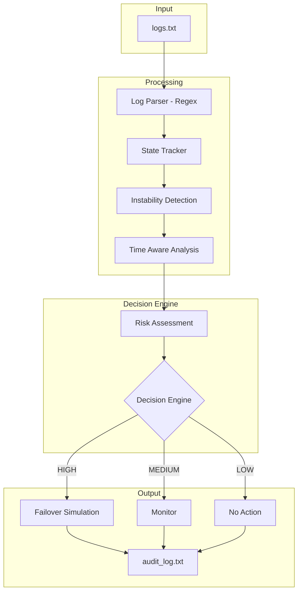

# AI Log Monitoring Agent

An AIOps-inspired Python project that monitors network interface logs, detects instability, predicts potential outages, and simulates intelligent failover decisions.

## 🧩 System Architecture




---

## 🚀 What It Does

- Parses Cisco-style network logs using regex
- Detects interface up/down state changes
- Tracks historical behavior per interface
- Identifies instability and flapping patterns
- Applies time-aware prediction logic
- Evaluates backup path availability
- Simulates automated failover decisions
- Logs structured audit events in JSON format

---

## 📊 Example Output

```text
Risk Level: HIGH
Reason: Firewall-1 is unstable and may impact Client-Site-A
Avg Time Between Events: 0.00s
Backup Status: Backup-WAN is DOWN
Backup Status: LTE-Failover is UP
Recommended Action: Prepare failover to LTE-Failover
ACTION: FAILOVER TRIGGERED → LTE-Failover
Prediction: HIGH instability — likely outage soon
```

## 🧠 Key Feature: Time-Aware Intelligence

This system evaluates not just how often failures occur, but how quickly they happen.

- Rapid state changes → triggers failover  
- Slower instability → monitored without overreacting  

This reflects real-world NOC (Network Operations Center) decision-making.